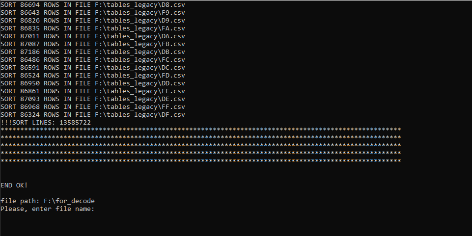

# Конвертирование адресов Bitcoin в hash160, сортировка и сохранение в файлы csv. Для использования как баз данных для программ Brute-force. *Версия 1.2.*

## Файл config.cfg
* ***"folder_with_files_for_decode": "F:\\for_decode"*** - путь к папке с файлами адресов. Указываете папку в которой лежат файлы адресов. Программа в цикле будет запрашивать имена файлов и искать их в этой папке.
* ***"folder_for_tables_legacy": "F:\\tables_legacy"*** - путь к папке, в которую будут сохраняться файлы hash160 адресов Bitcoin Legacy (1"address")(BIP32, BIP44)
* ***"folder_for_tables_segwit": "F:\\tables_segwit"*** - путь к папке в которую будут сохраняться файлы hash160 адресов Bitcoin SegWit (3"address")(BIP49)
* ***"folder_for_tables_native_segwit": "F:\\tables_native_segwit"*** - путь к папке в которую будут сохраняться файлы hash160 адресов Bitcoin Native SegWit (bc1q"address")(BIP84)
* ***"folder_for_tables_ethereum": "F:\\tables_ethereum"*** - путь к папке в которую будут сохраняться файлы hash160 адресов Ethereum (0x"address" or "address")

## Описание
При запуске программы, считываются настройки из файла config.cfg.
В консоли выводится надпись
> *Please, enter file name:*

ввести название файла с адресами, которые будут преобразовываться в hash160. Файл будет искаться в папке "folder_with_files_for_decode" указанной в config.cfg.
*(В файле адреса должны храниться ввиде строк(без лишних символов). Каждый адрес в отдельной строке)*

> *[0] - Bitcoin Legacy (1"address"),*
> *[1] - Bitcoin SegWit (3"address"),*
> *[2] - Bitcoin Native SegWit (bc1q"address"),*
> *[3] - Ethereum (0x"address" or "address")*
> *Please, enter addresses type:*

ввести тип адресов которые будут декодироваться.
[0] - Legacy(BIP32, BIP44), [1] - SegWit(BIP49), [3] - Native SegWit(BIP84), [2] - Ethereum

Далее начнется поиск в файле соответствующих адресов. Адрес в файле должен занимать одну строку. Строки (адреса) которые не соответствуют условия будут игнорированы, тем самым можно использовать файл, содержащий адреса Bitcoin Legacy и Bitcoin SegWit. Адреса преобразуются в hash160, делятся на 256 файлов, в соответствии первого байта hash160 и имеют названия 00.csv...FF.csv. В каждом файле удаляются дублирующие строки и сортируются по возрастанию. После, снова можно выбрать другой файл адресов и hash160 будут добавляться и сортироваться к уже существующим таблицам.

> *READ 10000000 ROWS*

Количество строк в файле с адресами.

> *DECODE ADDRESSES: 3919684 | FAILED LINES: 6080316*

Количество адресов декодированных в hash160 и кол-во строк, которые не соответствуют формату адреса.

## Файл CreateBruteForceDatabaseV12.exe находится в папке exe

### ОБСУЖДЕНИЕ КОДА: https://t.me/BRUTE_FORCE_CRYPTO_WALLET

## If you want to support the project don't hesitate to donate.
**BTC** - bc1qqldn5lyk54rcvf5ndruh525v0qz8lf9yu5t9a5 
**ETH** - 0x1193901D25604F55f5fA93Be09F5203b4B6F265f