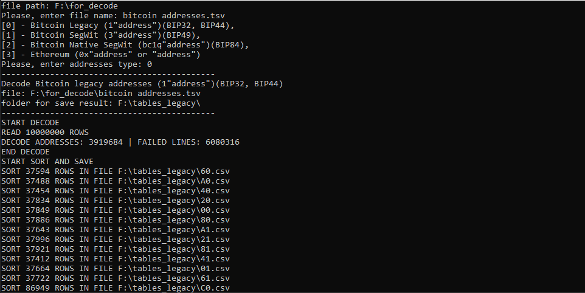

# Конвертирование адресов Bitcoin в hash160, сортировка и сохранение в файлы csv. Для использования как баз данных для программ Brute-force

## Файл config.cfg
* ***"folder_with_files_for_decode": "C:\\Disk_E\\Projects_NEW"*** - путь к папке с файлами адресов. Указываете папку в которой лежат файлы адресов. Программа в цикле будет запрашивать имена файлов и искать их в этой папке.
* ***"folder_for_database_legacy": "C:\\Disk_E\\Projects_NEW\\DB_LEGACY"*** - путь к папке, в которую будут сохраняться файлы hash160 адресов Legacy
* ***"folder_for_database_segwit": "C:\\Disk_E\\Projects_NEW\\DB_SEGWIT"*** - путь к папке в которую будут сохраняться файлы hash160 адресов SegWit

## Описание
При запуске программы, считываются настройки из файла config.cfg.
В консоли выводится надписи
> *Please, enter file name:*

ввести название файла с адресами, которые будут преобразовываться в hash160. Файл будет искаться в папке "folder_with_files_for_decode" указанной в config.cfg
> *Please, enter addresses type:*

ввести тип адресов которые будут декодироваться.
[0] - Legacy, [1] - SegWit

Далее начнется поиск в файле соответствующих адресов. Адрес в файле должен занимать одну строку. Строки (адреса) которые не соответствуют условия будут игнорированы, тем самым можно использовать файл, содержащий адреса Legacy и SegWit. Адреса преобразуются в hash160, делятся на 256 файлов, в соответствии первого байта hash160 и имеют названия 00.csv...FF.csv. В каждом файле удаляются дублирующие строки и сортируются по возрастанию. После, снова можно выбрать другой файл адресов и hash160 будут добавляться и сортироваться к уже существующим базам.

> *READ 10000000 ROWS*

Количество строк в файле с адресами.

> *DECODE ADDRESSES: 3919684 | FAILED LINES: 6080316*

Количество адресов декодированных в hash160 и кол-во строк, которые не соответствуют формату адреса.

## Файл CreateBruteForceDatabase.exe находится в папке exe